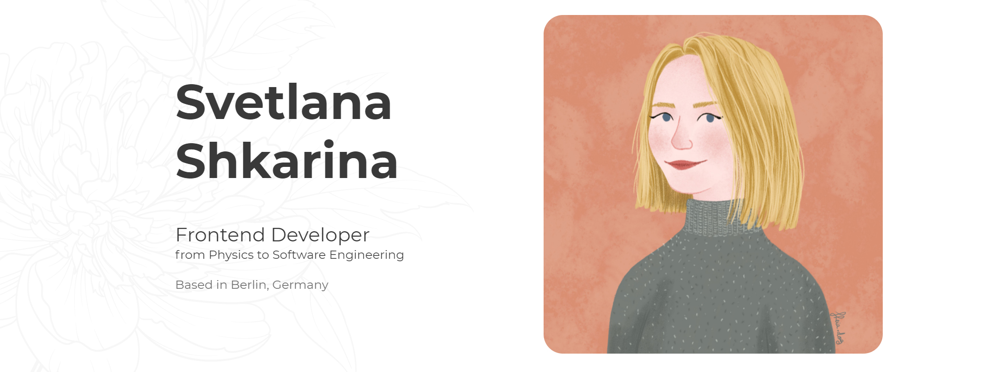

### Hi there 👋 I'm Svetlana!

I'm a former physicist and materials scientist who has a great passion about frontend development and wants to become a part of a tech community!

During my scientific career I applied my knowledge in programming to make life easy by automating some routine processes. I enjoy working with 👴HTML, CSS, as well as :baby:JavaScript, ReactJS, NextJS technologies.

When I'm not coding you can find me drawing, playing piano, jogging  or exploring Berlin! I also have a super-duper cat, which I adore!

<!-- LinkedIn Contact -->
  
  
<!-- Email -->
  
  

