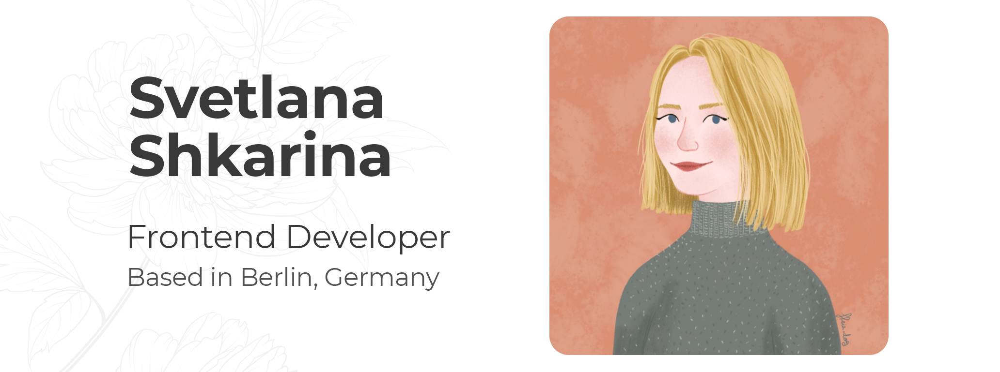

### Hi there  I'm Svetlana! 

I'm a former physicist and materials scientist :woman_scientist: who has a great passion for frontend development :woman_technologist: and wants to become a part of a tech community!

During my scientific career, I applied my programming skills to make life easier by automating routine processes. 

I am in love with the feeling of satisfaction when you create a thing from scratch to a full-fledged application and can see how it serves the conceived purposes. I enjoy working with :older_man: HTML, CSS, as well as :baby: JavaScript, ReactJS, NextJS technologies.

When I'm not coding you can find me drawing, playing piano, jogging, or exploring Berlin!
<!-- Personal website -->

<!-- LinkedIn Contact -->
  
  
<!-- Email -->
  
  

